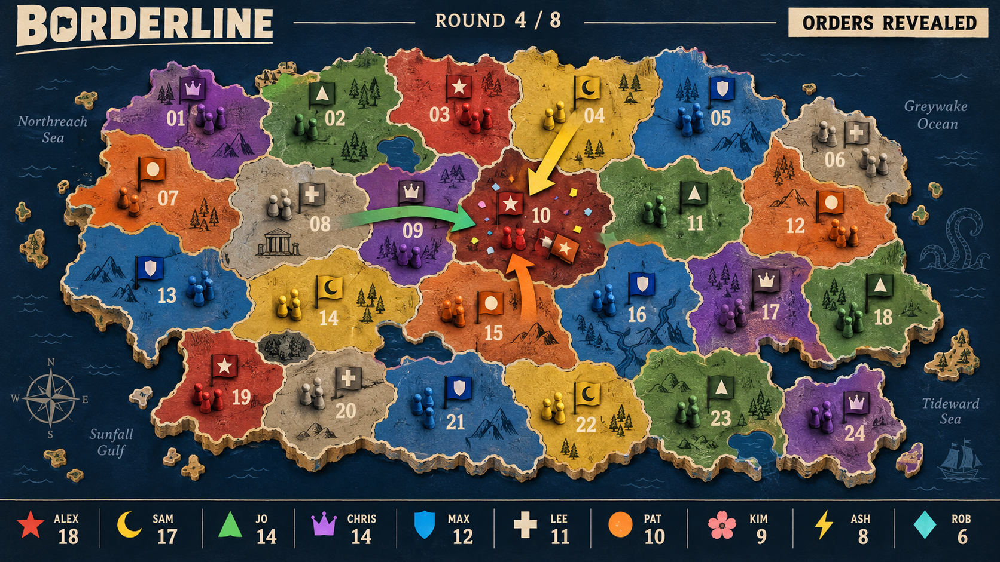

# Borderline

Design reviewed, 12 September 2026. **Prototype implemented; not yet validated as fun.** Independent visual acceptance passed. [Verification evidence and remaining gates](docs/concepts/borderline-verification.md).

A six-minute world-conquest game: promise peace, secretly choose one invasion or guard order, then watch everyone's borders change together.

## What changed during critique

The original fixed three-troop expedition offered little strength choice. Permanent reinforcements risked fortresses, and spawning attacks never exposed an origin despite implying army movement. We removed persistent armies altogether.

The next proposal had base defense 1 and scoring every third turn. Independent review found two traps: force 1 could never capture occupied land, and guard 3 offered nothing guard 2 did not already provide. Checkpoint scoring also encouraged saving 3 for the scoring turn. Final rules use zero passive defense and score every turn.

Two independent design reviews support a prototype with the rules below. Their approval concerns a coherent, teachable, testable design, not evidence of social fun. Remaining risks: collisions feeling futile, guarding rarely being worthwhile, early territorial reach snowballing, kingmaking, phone lookup time and ten-player reveal legibility.

## Player promise and concept sheet

| Field | Decision |
| --- | --- |
| The moment | “You promised you were invading Alex. Why are you taking my country?” |
| Shape | Competitive free-for-all with voluntary spoken deals, simultaneous secret orders, no elimination. |
| Screen | One fixed fictional world scaled at launch: 12, 15, 18 or 24 large numbered provinces for 3–10 players. Ownership uses existing seat colour plus faction emblem. Clearly marked home ports sit at the edge. |
| Controls | Portrait: Invade/Guard, stable numbered target grid, available Strength 1/2/3 cards, Confirm order. No dragging, typing, army slider, or separate phone battlefield. |
| Ergonomics | Sequential taps, no combined inputs. Minimum 48px targets and safe-area support. All territory buttons fit without scrolling; positions never change when eligibility changes. |
| Shared agency | Every player owns one independent order. Spoken deals have no enforcement UI; different attackers never combine forces. Public remaining strength cards make threats assessable. |
| Escalation | Borders and available strength cards change; the 20-second planning window never shrinks. |
| Eliminated players | Losing all land does not remove the player: their permanent home port still permits ordinary invasions at two fixed entry provinces. |
| Scoring | After every turn, bank one point per province owned. Sum across nine turns; rank by this score, sharing places on ties. Pass the raw score/place through the existing shell results contract. No kill, leader-target, home-port, or participation bonus. |
| Round length | Nine campaign turns, each 20s planning + 6–8s reveal/scoring. Roughly six minutes including teaching and results. One campaign per party rotation. |
| Build cost | Medium relative to a two-button game: deterministic rules are modest; map balance, private controller state and readable ten-player reveals are the work. |
| Risk | Choosing a target feels like random collision or obvious expansion instead of a consequential decision. |
| Fun hypothesis | Players make and reinterpret deals, deliberately choose when to use stronger forces, and understand the reveal well enough to react to one another. |
| Onboarding | Five numbered, narrated lessons lasting about 80 seconds, followed by 25 seconds to try a harmless practice order. Phones explain used cards and available choices. |
| Launch runway | Load host/controller/assets, show identity and portrait controls, teach/practise, reset the practice state, then a visible shared 3–2–1–GO. Never start the real timer while controls are loading. |
| Art direction | Cut-paper atlas over a deep navy sea, warm cream type, chunky flags and strength card counters. See the concept image below. |
| Animation | Orders flip together; short force trails clearly originate at faction emblems/home ports, not fictional departing garrisons. Battles share a timeline; contested provinces receive brief emphasis. Flags change only on resolution, then scores visibly bank. |
| Audio | Quiet paper clicks, committed-order confirmation on the relevant phone, host lock/reveal cue, takeover or held-border cue, and score stamp. Batch simultaneous effects; every cue has a visual equivalent. Music is optional after the core loop proves itself. |
| Recovery | Fixed launch roster; late arrivals wait for the next campaign. Reconnect restores strength cards, deadline, legal targets and acknowledged order. Host refresh follows the shell's seeded round-restart contract. Missing input has the explicit fallback below. |
| Accessibility | No colour-only identity, no sound-only rules, no time-critical reflex input. Large readable digits and labels, keyboard/focus states, reduced-motion fades and static battle outcomes. |

## Exact rules for the first build

### World and access

- Support **3–10 players**. Freeze the map and roster at launch: 3–4 players use 4 × 3 provinces (12); 5–6 use 5 × 3 (15); 7–8 use 6 × 3 (18); 9–10 use 6 × 4 (24). Disconnects and late arrivals never resize an active campaign. These tiers preserve early contact; smaller groups do not play on an empty ten-player map.
- Use orthogonal adjacency matching the phone grid, with starting homes distributed around the map perimeter. Each player starts with one distinct owned province and a permanent, unscored home port. All other provinces start neutral.
- Each port visibly identifies two fixed entry provinces. The player may invade either entry province whenever it is not theirs, even with no land remaining. Owned entries can be guarded normally. Port entry sets may overlap; ports themselves cannot be captured.
- An invasion may target any non-owned province bordering an owned province, or either home entry province. A guard may target any owned province. No player chooses a source, moves a standing army, or loses force from an origin.
- Determine ownership and legal destinations from the frozen state when planning opens. Later simultaneous captures cannot invalidate committed orders or unlock extra moves in the same turn. Swapping two provinces is possible.
- Layout acceptance: no isolated player, no single blocked entry that prevents all recovery, comparable initial options, and early contact between neighbours. Check actual graph distances and seeded assignments, then playtest; province count alone proves none of this. Revise geometry rather than adding teleport powers.

### Strength cards and orders

- Each player receives three strength cards: **1, 2 and 3**. Play exactly one each turn. It is spent even if the invasion fails or the guarded province is not attacked.
- After turns 3 and 6, all three cards return. No resource income, stockpiling, troop attrition, territory garrisons or hidden dice.
- Remaining cards are public. The selected mode, target and card remain private until lock. The final card in a three-turn cycle is consequently deducible; this is intentional.
- Territory has **zero** passive defense. Guarding supplies exactly the chosen force for this turn. All force expires after resolution; ownership persists.
- An acknowledged committed order can be edited until the host's deadline. Editing does not release it: the previous accepted order remains active until its replacement is acknowledged. No early resolution when everyone commits, since players can change their minds.
- Missing input: spend the lowest remaining card. If the player owns land, guard their lowest-numbered owned province; otherwise pass without invading. Show this exact fallback and target on the phone throughout planning. It is not a secret strategic AI. A previously acknowledged order executes despite a disconnect.

### Combat

Resolve each province independently using the same frozen orders:

1. The defender has its chosen guard strength, or zero if there is no guard.
2. Find the highest invading strength. If more than one attacker has that strength, **nobody captures** the province.
3. Otherwise, the unique strongest attacker captures only if its strength is strictly greater than the defending strength.
4. In all other cases, ownership stays as it was, including neutrality. A weaker attacker never inherits a win when stronger attackers tie.
5. Apply all ownership changes together, bank each player's territory score, expire all force, and refresh cards if the three-turn cycle ended.

Examples that must survive implementation and animated teaching:

| Orders at one province | Outcome |
| --- | --- |
| Invade 1; no guard | Invader captures, whether territory was neutral or occupied. |
| Guard 1; Invade 1 | Owner holds. |
| Guard 1; Invade 2 | Invader captures. |
| Guard 2; Invade 3 | Invader captures. |
| Guard 3; Invade 3 | Owner holds. |
| Invade 3, Invade 3, Invade 2; no guard | Existing flag stays; the 2 does not win. |
| Invade 3, Invade 2; no guard | The 3 captures. |
| A invades B's land; B invades A's land; neither guards | Both captures succeed if uncontested, even if each loses its last original province. |

Public shorthand: **“Unguarded land can be taken. Strongest force wins; a tie for strongest leaves the flag where it was.”** The teaching sequence must demonstrate both defender ties and ties between attackers.

### Controller and shared display

- Choose **Invade** or **Guard**, then a numbered province, then an available strength card, then **Confirm order**. Keep the target grid spatially stable; disable illegal options without shuffling, filtering away slots, or scrolling. Clearly label neutral/owner identity without small troop statistics.
- Match the numbered phone pad to the launch map: 4 × 3, 5 × 3, 6 × 3 or 6 × 4. Preserve this mapping for the entire campaign and keep every action at least 48px high.
- Before confirmation, show exactly e.g. **INVADE 12 · STRENGTH 2**. After host acknowledgement, show **Confirmed** and a smaller Edit action. Spent cards are visibly crossed out; label **“Use each card once. All three return after turn 3.”** Update the turn reference for subsequent cycles.
- The phone holds choices, selected order and acknowledgment. The projector owns the strategic overview. No private order arrows on the projector before lock, and do not broadcast one player's private order to other controllers.
- At lock, phones say **Look up**. Reveal all orders together, animate battles in parallel, briefly emphasize clashes, and leave a short outcome ledger for each faction. Never make players watch ten sequential turns. A player's phone can confirm its own outcome during recap.
- Projector HUD: turn, phase/deadline, compact ten-player name/emblem/score strip with remaining 1/2/3 cards. Use ten realistic names at 1920×1080 for inspection. Remove decorative geography before shrinking meaningful labels.
- Teach: force 1 takes unguarded land; guard 2 stops force 1; equal strongest forces keep the flag; practice and card refill; permanent port recovery. Practice changes neither scores nor real starting state.

## Evidence required before calling the build finished

Use the repository's engineering-manager, party-game-verification and verify-sideshow workflows. Preserve host-owned simulation, opaque shell game payloads and existing identity/standings contracts. Inspect current source rather than assuming this design describes current APIs.

Automated public-seam cases: all combat examples above, insertion-order independence, start-of-turn legality, force reuse rejection/refill, stale/late/duplicate input, owner-only order acknowledgements, deadline fallback, zero-land recovery, scoring ties and seeded restart. Run `npm run verify` and record the tested revision.

Real surface: lobby → cold launch → practice → nine turns → standings → next game; ten independent controllers; one locked/disconnected phone and reconnect; missing input; host refresh; muted and reduced-motion play; minimum supported phone size; readable projector at ten seats. Use authentic browser journeys available in the execution environment and report any unavailable surface as a gate, not a simulated pass.

Independent playable design review must inspect whether:

- A newcomer makes their second order without explanation and can explain a battle result.
- Players sometimes choose Guard deliberately and use different strength card orders for board reasons.
- A player with no land can pursue their own score, rather than merely decide who else wins.
- Players bargain while mostly looking at the shared board; phone lookup does not eat the planning window.
- Collisions prompt adaptation instead of repeated helplessness; early leaders remain contestable.
- The nine-turn campaign fits approximately six minutes without unreadable reveals.

Automated policy simulations can expose degeneracy, but cannot establish these social claims. Declare PLAYTEST-READY only after technical/production gates pass. A real mixed-experience group must establish the fun hypothesis before PLAY-READY.

## Visual reference

The image is art direction, not authoritative rules or ready-to-use UI. It shows only seven factions owning land despite ten score entries, and some arrows have ambiguous origins. Correct those issues in the build. Replace static army piles with temporary force markers; ensure all ten players begin visibly represented. Derive live map/UI from native rendering for accurate labels, ownership and animation.

## First-play clarity — 18 September 2026

Player feedback showed that “Force” implied a missing soldier inventory, that final confirmation was easy to miss, and that the initial 1.8-second teaching cards were too fast. The rules are unchanged: each player spends one strength card (1, 2 or 3) on one order; there is no standing army or stockpile. Each card is used once before the three-turn refill.

The phone now calls these **Strength cards**, guides each choice in sequence, and highlights **Confirm order** when a complete order is ready. A gentle pulse draws attention without flashing; reduced motion retains a static highlight. Orders never submit merely because a draft has been selected. **Confirmed** appears only after host acknowledgement; editing preserves the previous confirmed order until a replacement is confirmed.

Teaching uses five synchronized, numbered lessons, with the full narration also available as text, and a longer practice window. The shared projector supplies optional commander-style narration; phones do not create a roomful of competing narrators. Human comprehension remains the next playtest question.
