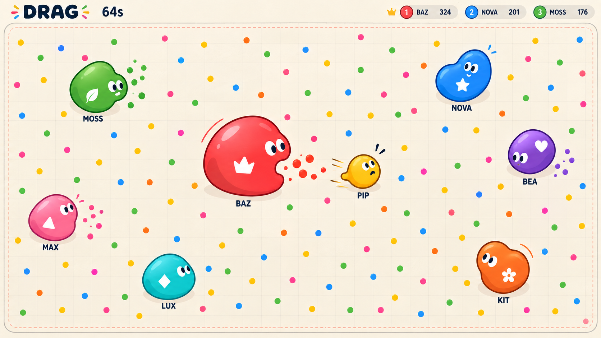
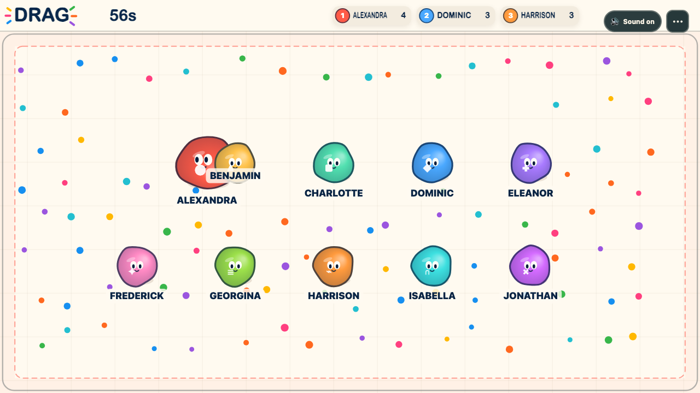

# Ink + Jelly implementation target

The user selected Ink Playground's clarity combined with Jelly Lab's squish and expressive faces. Generated with the built-in image tool using both saved concept images as references. This is the canonical visual reference for this branch:

## Acceptance contract

- Warm ivory, very faint sparse grid; subtle coral safety boundary, small quiet peach margin rather than an oversized hazard band.
- Saturated softly shaded jelly blobs with dark hue-matched outlines, restrained upper-left shine and small contact shadows.
- Smooth deforming silhouettes; expressive white eyes with dark pupils and a separate white seat symbol. Size/identity remain legible with ten players.
- Colourful solid food dots without food outlines or pool rings.
- Compact light HUD and clear dark names with minimal cream backing. Avoid large dark rectangular labels.
- Movement, eating, danger and protection remain clear in motion; reduced motion preserves meaning.
- Match the art direction in the real renderer, not by displaying the concept as a static backdrop. Preserve tested mechanics and warning fairness; test any changed geometry.

An independent critic must inspect this image and real built-app screenshots, report specific mismatches, and approve only when the implemented visual language matches. Final human fun/balance testing remains separate.

## Implemented result

The independent visual critic approved the final native-canvas implementation after iterations on scale, face orientation, lighting, labels, banner layout and deformation bounds.

[Built phone](implementation-phone.png) · [Verification and remaining playtest questions](../../drag-verification.md)

## Exact prompt

Use case: stylized-concept. Create ONE definitive, implementable 16:9 gameplay visual reference for DRAG, a shared-screen Agar.io-inspired party game. Reference image 1 (Ink Playground) establishes the warm ivory paper arena, subtle square grid, rich saturated colours, dark crisp outlines and clean names. Reference image 2 (Jelly Lab) establishes smooth squishy rounded bodies, soft gradient depth, restrained jelly highlights and expressive facial features. Combine those into one cohesive design, favoring the clarity and warmth of image 1. This image will be used by developers and an independent critic as the actual implementation target; use plausible in-game scale and restraint rather than a cinematic poster.
A straight top-down orthographic 2D game screen, 16:9, no device mockup or perspective. Compact ivory top HUD occupying about 9% of height: left small playful title DRAG, next bold "64s", top right three compact light ivory score pills with coloured circular seat numbers and names BAZ, NOVA, MOSS. No giant logo, no glossy dark HUD. Main arena extends almost to image edges. Thin quiet slate rounded boundary; a soft peach margin and inset dashed muted coral danger line stay subtle and occupy little space. Fine sparse warm grey grid at low contrast.
Show exactly 8 live player blobs in a natural scattered chase composition with room for 10. Bodies are smooth squishy circles with gentle asymmetry, bounded size ratio around 2.1x largest to smallest. Largest body diameter about 100px at 1280x720, smallest about 48px; do not fill half the screen with a hero blob. Rich opaque colour core, dark hue-matched 2-3px contour, a soft little lower-edge shade, one broad restrained translucent highlight near upper left, tiny soft contact shadow. Two expressive white eyes with dark pupils look along movement; eyes and a small simple white geometric seat stamp occupy separate parts of the body. One large red BAZ pursues smaller yellow PIP with worried eyes; others NOVA blue, MOSS green, BEA purple, MAX pink, LUX cyan, KIT orange. Names as clear dark navy bold text immediately below or above their bodies, subtle cream backing ONLY if needed, never huge black plaques. Numbers/symbols preserve identity independently of colour.
About 128 tiny colourful solid food dots evenly but organically scattered inside safe arena; dot colours from the saturated palette, slightly irregular sizes, NO rings or outlines around food or food patches, no shadows on every dot. Food smaller and quieter than blobs. Tiny short-lived food pickup motes, one modest lunge stretch, no long permanent trails, no giant explosion. Show one small recovering player's dashed cream shield halo only if uncluttered. High projector readability, smooth friendly tactile game feel. No glass refraction, no neon, no sterile mint background, no raster-heavy decoration. Only on-screen text listed above. Deliver a single polished game screenshot concept.

