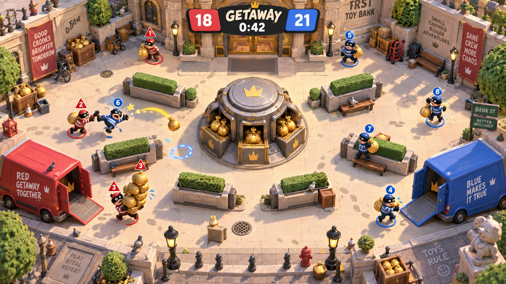
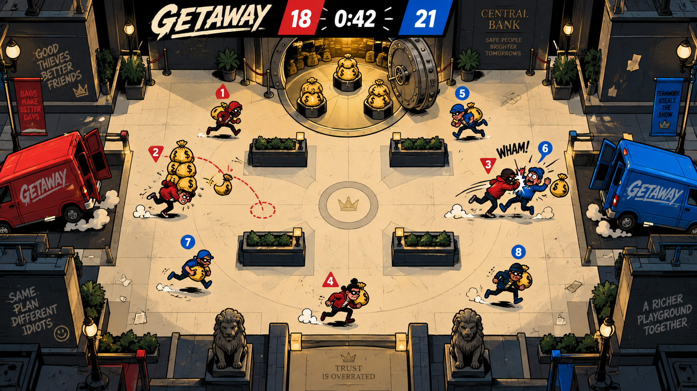
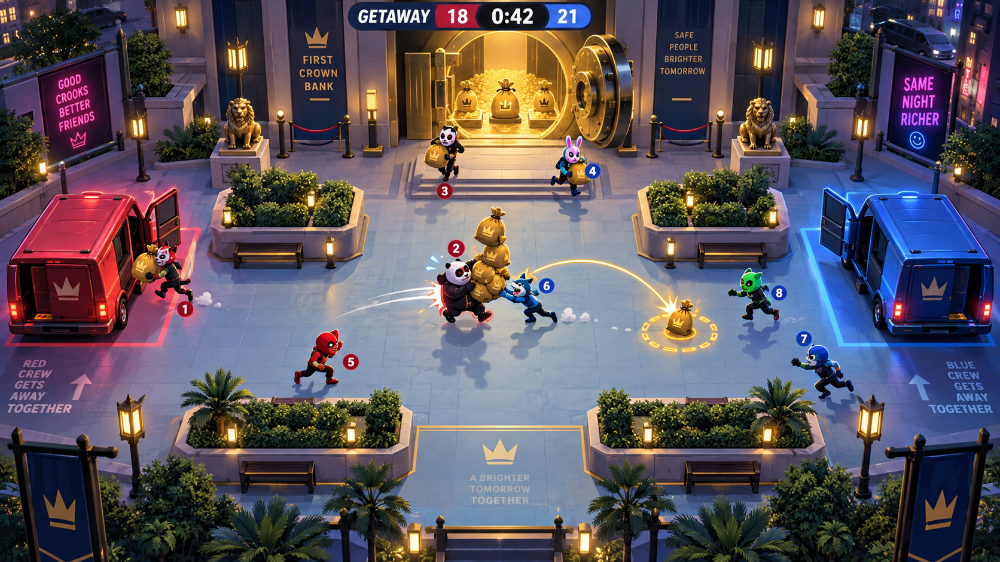

# Getaway: spill feedback and visual concepts

These are art-direction mockups generated with the built-in image generation tool. They are not implemented screenshots, final maps or production assets. Prompts are recorded in [prompts.md](prompts.md). No game code changed during this exploration.

## Recommended mechanic adjustment

The reported stationary re-pickup is real. The current sack spawns 32 world units ahead of the victim, travels in the shove direction at 130 units/s, and decays under heavy drag. The victim receives a 265 units/s impulse. When the owner's 0.8-second pickup block expires, their separation is roughly 19 units (up to about 24 including scatter), inside the 45-unit pickup radius. The existing recovery test does not prove that the spill is spatially contestable.

Proposed change, not yet implemented:

- Toss the sack sideways into a clear landing position approximately two character widths from the victim's post-stumble position. A character diameter is 56 world units; start testing near 112 units of separation.
- Select a clear side deterministically, respecting the arena and cover. Give both crews a visible landing marker and short readable arc.
- Keep the 0.8-second owner lock, and require the owner to have been outside the pickup area before re-entry can recover the bag. This prevents wall-constrained overlap from becoming automatic recovery.
- Preserve the 0.25-second stumble, 1-second shove cooldown and 1.2-second protection. Change the contest for loot rather than increasing stun pressure.
- Normalize the drop direction correctly for vertical hits. The current horizontal `directionX || fallback` substitutes a nonzero x component even for a valid vertical hit.

Acceptance checks: a stationary victim cannot re-collect; another player can collect after landing; the owner can deliberately leave and return; vertical hits and wall/cover cases preserve the rule; protection still prevents repeated juggling. A longer lock alone would only delay the current symptom.

## Visual directions

### Toybox Caper — recommended for character and comedy

Tactile miniature bank, squishy masked crooks, warm light, teetering sack stacks and toy vans. The strongest opportunity is physical comedy: loaded players lean and waddle, a shove briefly stretches the victim's pose, a bag bounces to a marked landing spot, and a van rocks on its suspension as a delivery lands. The richer art would require an asset/animation pass; this is not a small palette change.

### Comic-book Caper — strongest fit for the existing 2D renderer

Chunky inked silhouettes, paper warmth, sharp impact marks, exaggerated running and skidding poses. Selective trails and impact bursts add energy while the floor stays calm. This is the most direct evolution of the current Canvas presentation.

### Neon Night Job — a more theatrical arcade heist

Animal masks, gold vault light, coral/cyan crew accents and a bright cool courtyard against a dark city perimeter. Light identifies important gameplay objects; restrained effects keep the gold readable. This direction needs projector testing so its night atmosphere does not hide players.

## Production constraints across all three

Retain the existing shared arena and core rules while choosing an art style. Use a more overhead camera than the generated studies, preserve unoccluded routes and the central vault, make every seat badge unique, and simplify decorative signage. The generated compositions include incidental layout and text details that are not proposed mechanics or final UI.

The priority is readable motion: heavy carriers, directed shoves, contestable spills and satisfying deliveries. Richer scenery alone cannot validate the game's fun hypothesis. Human testing must still establish whether escorting, stealing and escaping are worth doing.
