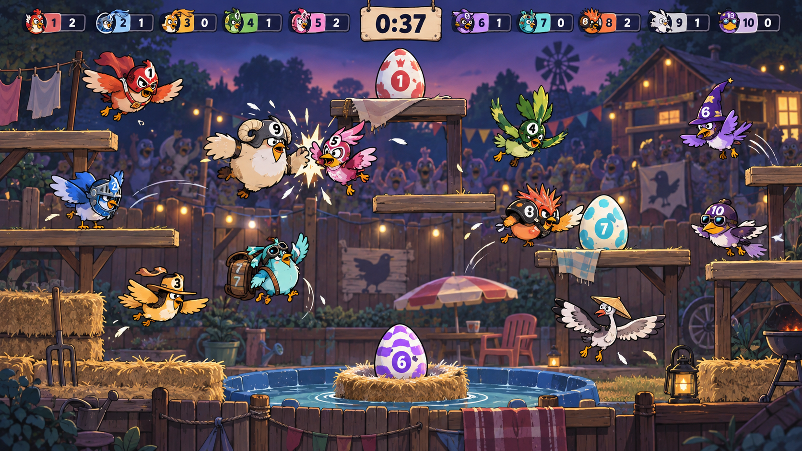
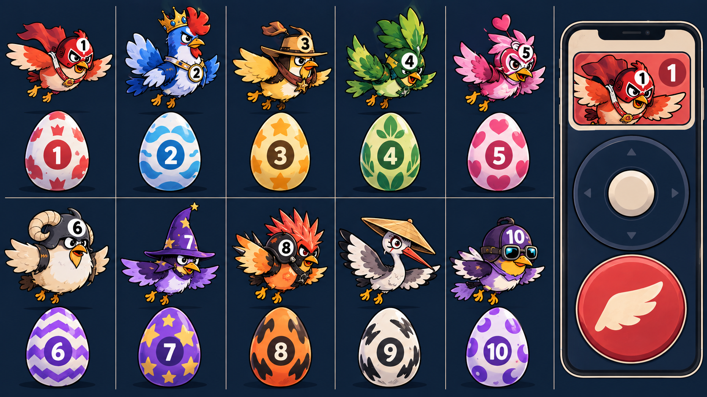

# Joust visual direction

Status: approved direction for production exploration. These images are concept
references, not runtime assets.

## Featherweight Championship

Joust is presented as an absurd backyard bird-wrestling broadcast. Chunky,
costumed competitors flap for height, smash rivals away, and scramble after
owner-marked eggs while a garden crowd treats the chaos like a title fight.

## Production rules

- Use a fixed, orthographic 16:9 side view. The arena must not adopt the
  cinematic perspective or decorative density of the keyframe.
- Read order from projector distance: birds, collision, loose eggs, platforms,
  timer and score.
- Keep the dusk navy/teal background quiet. Use cream for collision surfaces
  and labels, with the shell's ten saturated seat colours for identity.
- Every seat gets a unique body proportion, headgear silhouette and internal
  pattern. Colour is supporting identity, never the only identity.
- Repeat the seat number and pattern on the bird, its egg and its phone. Names
  remain native UI text rather than baked into art.
- Make eggs deliberately oversized and place them in clear contested space.
  Decorative egg-shaped objects are not allowed in the environment.
- Keep impact bursts short and local. Feathers, shake and trails must never
  hide the height relationship or the egg trajectory.
- Build moving birds, eggs, platforms, labels and controller UI with Canvas,
  SVG or CSS so they scale, tint and animate cleanly. Generated raster art is
  reference material only.

## Seat identity roster

| Seat | Silhouette anchor | Egg motif |
| --- | --- | --- |
| 1 | Round masked champion with broad cape | Crown burst |
| 2 | Tall crowned rooster with wide wings | Cloud scallops |
| 3 | Squat wide-brimmed ranger | Large stars |
| 4 | Leaf-crested agile bird | Leaf cluster |
| 5 | Heart-crested compact bird | Hearts |
| 6 | Heavy ram-helmet bruiser | Chevrons |
| 7 | Pointed-hat narrow bird | Stars |
| 8 | Forward-leaning punk crest | Flame shapes |
| 9 | Long-beaked conical-hat bird | Lightning slashes |
| 10 | Goggle-and-cape round bird | Large spots |

The final silhouettes must still be distinguishable as solid monochrome shapes
at thumbnail size. Hats alone are insufficient if the underlying bodies match.

## Motion language

- **Flap:** fast anticipation dip, wing snap, body lift and one short feather
  trail.
- **Level collision:** compressed contact pose, neutral cream star, then equal
  opposing knockback.
- **Winning collision:** vertical contact line remains visible, followed by a
  sharp squash, shell burst and wider loser knockback.
- **Egg drop:** one readable arc into open space, then a small landing squash.
- **Pickup:** egg pulls toward the collector, pops into their seat badge and
  increments score.
- **Respawn:** protected edge launch with a dashed cream shield perimeter.
- **Reduced motion:** remove shake, hit-stop and long trails; preserve contact
  outlines, direction arrows and state changes.

## Phone direction

The phone contains only a persistent seat identity card, one large drift stick
and one oversized flap button. It must not show score, egg state or arena
information. Pressed state uses scale/contrast plus optional haptics; connection
loss replaces the controls with one clear reconnecting state.

## Acceptance checks

- From four metres away, a viewer can reacquire at least eight of ten birds in
  under two seconds after looking away.
- A paused frame makes the higher collision winner and every loose egg's owner
  obvious without colour.
- Grayscale and simulated washed-out-projector checks preserve all identity and
  state mappings.
- Background spectators, bunting, props and particles are reduced until they
  never compete with a player silhouette.
